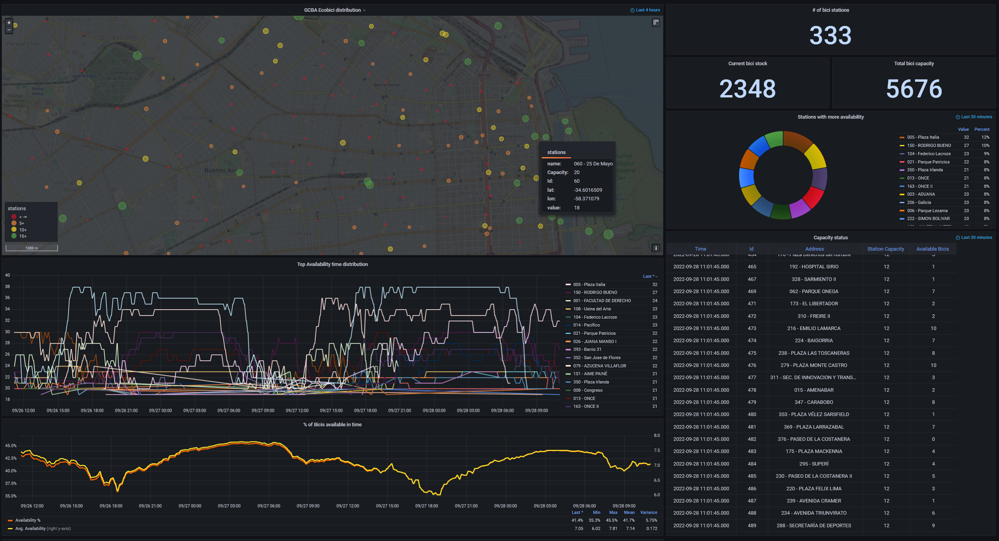

## GCBA API
City of Buenos Aires bikes stations real time data visualization service using grafana as UI and prometheus as time series storage.





### Install

```bash
pip install -r requirements.txt
python run.py
```
A `/metrics` endpoint is exposed by python service so prometheus can scrape it.

### Parameters
Basic parameters that can be configured using .env file in `src/config` folder

```bash
GCBA_API_CLIENT_ID=<CLIENT_ID>
GCBA_API_CLIENT_SECRET=<CLIENT_SECRET>
GCBA_API_SAMPLING_TIME=600
```

### GCBA API data structure example

```json
{   
    "data": {   
        "stations": 
        [   
            {   "address": "AV. Dr. José María Ramos Mejía ",
                "altitude": 0.0,
                "capacity": 20,
                "groups": ["RETIRO"],
                "is_charging_station": False,
                "lat": -34.59242413,
                "lon": -58.37470989,
                "name": "002 - Retiro I",
                "nearby_distance": 1000.0,
                "obcn": "",
                "physical_configuration": "SMARTLITMAPFRAME",
                "post_code": "11111",
                "rental_methods": [ "KEY", "TRANSITCARD", "PHONE"],
                "station_id": "2"
            },
            {   
                "address": "Moreno & Av Paseo Colon",
                "altitude": 0.0,
                "capacity": 20,
                "cross_street": "Moreno & Av Paseo Colon",
                "groups": ["MONSERRAT"],
                "is_charging_station": False,
                "lat": -34.611032,
                "lon": -58.3682604,
                "name": "003 - ADUANA",
                "nearby_distance": 1000.0,
                "physical_configuration": "SMARTLITMAPFRAME",
                "post_code": "11111",
                "rental_methods": [ "KEY", "TRANSITCARD", "PHONE"],
                "station_id": "3"
            }
        ]
    }
}
```

### References
- https://data.buenosaires.gob.ar/dataset/
- https://www.buenosaires.gob.ar/datosabiertos/apis
